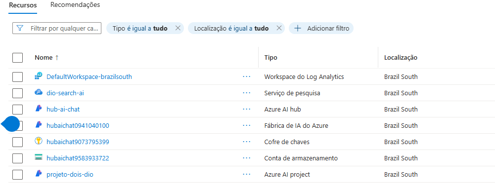

# Chatbot sobre conhecimento bancários

## Contexto e Motivação

No cotidiano acadêmico pode ser muito dificultoso realizar o fichamento ou levantamento de dados para criar um projeto de pesquisa.
O objetivo deste projeto é criar um chatbot para auxiliar nos meus estudos de conhecimentos bancários, principalmente, no fichamento das apostilas sobre o sistema financeiro.

## Modelagem

Usando o Foundry AI, criei um projeto com dois modelos:

- Modelo de Conclusão de Chat
- Modelo de Text Embeddings

#### Por que foram escolhidos estes dois tipos de modelos e o que significa cada um deles?

- O modelo de conclusão de chat é uma rede neural profunda que funciona com uma inteligêncial artificial generativa, geradora de texto, na qual, responde perguntas do usuários e tem a capacidade de se "reprogramar", ou seja, de atualizar seu conhecimento a partir do contexto da conversa e busca integrada na Web.
- O modelo de text embeddings converte o texto gerado pelo modelo em vetores, o vetor, é um conceito conhecido tanto na matemática, física e ciência de dados. O vetor é estrutura de dados "array", em linguagens como: Python e Java, o text embeddings vai ser usado para criar uma estrutura linear gerada pela pergunta do usuario que vai ser comparada com a estrutura linear do contexto pré-definido para responder a pergunta com maior confiabilidade, pois a resposta vai ser a mais perta da reta convertida pelo text embeddings.

## Etapas do projeto

#### 1° foi feita a preparação do ambiente, gerado grupo de recursos, um hub no Foundry AI e um novo projeto.

#### 2° foi feita  escolha dos dois modelos mencionados a cima.

#### 3° no playground chat foi feito upload dos dados de contexto para os modelos de duas apostilas sobre o Sistema Financeiro da Gran Cursos.

#### 4° no perplexity.ai pedi para que fosse gerado um prompt para melhor acuracia do modelo para atender o objetivo do nicho academico.
 
#### 5° também solicitei ao perplexity ai que fizesse perguntas para testar o modelo.

---

## Resultados dos testes.

Fiz a seguinte pergunta para o modelo baseado na resposta que o perplexity respondeu:

"Como o PIB influencia as decisões de política monetária?"

O chatbot respondeu:

"Fichamento acadêmico: Influência do PIB nas Decisões de Política Monetária  
  
**Conceitos principais:**  
O Produto Interno Bruto (PIB) é o indicador que mede o valor total de bens e serviços produzidos em um país em determinado período. Ele reflete o nível de atividade econômica e é fundamental para a formulação da política monetária, cuja finalidade central é garantir a estabilidade de preços e o controle da inflação.  
  
**Autores e teorias relevantes:**  
Autores clássicos como John Maynard Keynes abordam a relação entre atividade econômica e política monetária, destacando a necessidade de ajustes nas taxas de juros e na oferta de moeda para estabilizar o ciclo econômico. No contexto brasileiro, o papel do Conselho Monetário Nacional (CMN) e do Banco Central é central para a definição e execução das metas de política monetária, baseando-se em indicadores como PIB e inflação para suas decisões  ^1^  ^2^ .  
  
**Contexto histórico e atual da questão:**  
Historicamente, períodos de forte crescimento do PIB podem gerar pressões inflacionárias, levando as autoridades monetárias a elevar taxas de juros para conter a demanda. Em momentos de retração econômica, com queda do PIB, a política monetária tende a ser expansionista, reduzindo juros para estimular o crédito e o consumo.  
  
**Principais debates e divergências na literatura:**  
Há divergências sobre o timing e a intensidade das respostas de política monetária frente às variações do PIB. Monetaristas defendem uma abordagem mais previsível e regras fixas, enquanto keynesianos apoiam maior discricionariedade para responder a choques econômicos. O debate também envolve o papel das expectativas e da credibilidade das instituições monetárias.  
  
**Relações com políticas econômicas e práticas bancárias:**  
No Brasil, o CMN define as metas de inflação e o Banco Central conduz a política monetária para atingi-las, utilizando o PIB como um dos principais indicadores para calibrar suas ações. Isso inclui decisões sobre taxas de juros (SELIC), operações de mercado aberto e controle da liquidez bancária, impactando diretamente o custo do crédito e a atividade bancária  ^1^  ^2^ .  
  
---  
  
Resenha crítica:  
  
O PIB exerce influência decisiva sobre as decisões de política monetária, servindo como termômetro do desempenho econômico e orientando ações das autoridades monetárias. Quando o PIB cresce acima do potencial, há risco de inflação, levando à elevação das taxas de juros para conter a demanda agregada. Em contrapartida, retrações do PIB sinalizam necessidade de estímulo via redução dos juros e ampliação da liquidez. No Brasil, o Conselho Monetário Nacional estabelece metas para a inflação, enquanto o Banco Central ajusta os instrumentos de política monetária com base em indicadores como PIB, inflação e emprego  ^1^  ^2^ .  
  
A relevância acadêmica do tema reside na compreensão dos mecanismos de transmissão da política monetária e de como o PIB, junto a outros indicadores, orienta as decisões que afetam toda a economia. Socialmente, a correta calibração da política monetária é essencial para garantir estabilidade de preços, crescimento econômico sustentável e geração de empregos.  
  
Para o TCC, possíveis caminhos de análise incluem: o estudo do ciclo econômico brasileiro e sua relação com as decisões do Banco Central; a análise da eficácia da política monetária frente a diferentes comportamentos do PIB; e a comparação entre abordagens teóricas (keynesiana versus monetarista) na condução da política monetária. O tema também permite avaliar os efeitos dessas decisões sobre o sistema bancário, crédito, consumo e investimentos, estabelecendo conexões entre teoria econômica, política pública e prática bancária  ^1^  ^2^ .  
  
---  
  
Caso deseje aprofundar, posso sugerir referências bibliográficas ou autores específicos sobre política monetária e PIB."

E informou as duas fontes passadas como contexto de dados:

## Conclusão

O modelo ofereceu resposta detalhadas baseadas no material no modelo solicitado conforme esperado
